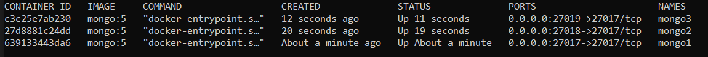

# MongoDb - Creating and maintaing a cluster


⚠️ _In real-time scenarios, there are many more things to pay attention to. If you are interested, you can always message me with questions._

## Overview (created by ChatGPT)

The provided guide explains how to create a MongoDB cluster using Docker containers for testing purposes and outlines the steps to make it production-ready. It covers setting up a replica set with three MongoDB instances running in separate Docker containers and demonstrates how to initiate the replica set.

For production-ready scenarios, the guide suggests two options: running the cluster using Virtual Machines or deploying it in Kubernetes. Both approaches have their advantages and challenges. Using VMs can be achieved manually or through infrastructure as code tools like Terraform and Ansible. On the other hand, deploying the cluster in Kubernetes involves working with StatefulSets, ensuring readiness probes are configured correctly, and considering the use of operators for MongoDB to simplify management.

The guide also touches on aspects of cluster monitoring, security, and backups. It highlights the importance of monitoring the cluster's health and setting up alerts based on various metrics. Additionally, it mentions the significance of having proper security measures, such as isolating instances on separate physical machines to avoid data loss in case of server failure. Furthermore, it emphasizes the necessity of regular backups to ensure data integrity and availability, especially in cloud environments where service level agreements do not guarantee 100% availability.

Overall, the guide provides valuable insights into setting up, managing, and securing a MongoDB cluster, both for testing and production purposes. However, it's important to note that best practices and technologies might continue to evolve and when implementing a MongoDB cluster, it is always advisable to refer to the latest documentation and community best practices to ensure optimal performance and security.

### Example from class

For the use case of the MongoDB database and its features, read more on their official learning platform: https://learn.mongodb.com/learning-paths/introduction-to-mongodb

When it comes to creating a MongoDB database, we can choose between hosting it in a cloud platform (see MongoDB Atlas) or host it on our own servers and maintain it.

Maintaining a database cluster requires more understanding about the database architecture, and it's more prone to errors if the knowledge is not complete and the cluster not set up properly. Using a cloud database service comes with a higher cost, and sometimes it's not an option for newer and smaller companies.

Let's start by explaining the MongoDB architecture.
There are two ways the MongoDB cluster can be defined:

Replica Set
Sharding
Architecture for Replica Set:


It consists of Primary nodes (accepts all the writes and reads by default) and Secondary nodes (can be configured to accept writes).
  
**_Note:_** _in this guide, we will speak and create a cluster, though for the purpose of testing a database locally, it's completely fine to use a single MongoDB instance._

We will cover multiple ways of creating the cluster together with what are the advantages and disadvantages of each.

*_Example from the class:_*

Let's remind ourselves of the example we used during the class:
We were creating a MongoDB cluster locally by creating 3 docker containers.

Probably the fastest way to create a cluster for testing purposes is by creating it from docker images.
Requirements:
  - Docker environment installed ([docker installation](https://docs.docker.com/engine/install/))

The first step is to create a Docker network. This network will let each of your containers running in this network see each other.
```
docker network create mongoCluster
```
We can pick a different network name.

Create 3 mongo instances from a mongodb image:
```sh
docker run -d --rm -p 27017:27017 --name mongo1 --network mongoCluster mongo:5 mongod --replSet myReplicaSet --bind_ip localhost,mongo1
docker run -d --rm -p 27018:27017 --name mongo2 --network mongoCluster mongo:5 mongod --replSet myReplicaSet --bind_ip localhost,mongo2
docker run -d --rm -p 27019:27017 --name mongo3 --network mongoCluster mongo:5 mongod --replSet myReplicaSet --bind_ip localhost,mongo3
```
Here we are telling docker to start 3 containers with parameters provided:
- mongo:5 
- name: mongo1, mongo2, mongo3
- network: previously created network
- replSet: name of the replica set to which the instances will belong to. We are going to create this replicaset once the instances are up.
- `-p 27017:27017` </br>
  `-p 27018:27017` </br>
  `-p 27019:27017` </br>
   We are mapping the port 27017 (default mongodb port) in the container to ports 27017/27018/27019 on the Docker host (our machine)

We can check if the instances were created properly by using the command:
```sh
docker ps 
```
And it should show all the instances running. 


In order to create the ReplicaSet, we need to enter into one of the instances, let's enter mongo1 and execute the command for creating the ReplicaSet.
To execute into a mongo1 instance, we use:
```
docker exec -it mongo1 mongosh 
```
- *mongosh* - mongo shell (fully functional JavaScript and Node.js environment for interacting with MongoDB deployments)

Now we can create the ReplicaSet by:
```js
rs.initiate({
 _id: "myReplicaSet",
 members: [
   {_id: 0, host: "mongo1"},
   {_id: 1, host: "mongo2"},
   {_id: 2, host: "mongo3"}
 ]
})
```

**rs** - replica set </br>

After which as a result we will have: ```{ ok: 1 }```

Now that all the members were added to the ReplicaSet, we can check their statuses with:
```sh
docker exec -it mongo1 mongosh --eval "rs.status()"
```
We can check for each instance and notice how we have one instance that is defined as **PRIMARY** and 2 instances that are defined as **SECONDARY**. 

Each instance also contains the info about which instance it will sync it's data to. 
This is important because of the [Replication](https://www.mongodb.com/docs/manual/replication/) of the data (as shown in the Architecure image).

By default, *every write and read* operation is executed on the Primary instance. This can be modified, we can enable reading from the Secondary instances with some consequences:
- Disables use of the multi-document transactions (all operations in a given transaction must route to the same member)
- Secondary instances may return stale data because secondaries replicate operations from the primary in an asynchronous process (we need to make sure that our application will not be affected by that)
- This enables higher availability since now there are 3 instances to read from

The Primary instance is chosen by all the members voting. Each instance has a priority (higher priority -> more likely to be chosen for a Primary). We can check this priories by running a command:
```sh
docker exec -it mongo1 mongosh --eval "rs.config()"
```
```js
...
 {
      _id: 2,
      host: 'mongo3:27017',
      arbiterOnly: false,
      buildIndexes: true,
      hidden: false,
      priority: 1,
      tags: {},
      secondaryDelaySecs: Long("0"),
      votes: 1
    }
...
```

If we want to change which member is a Primary member, we need to increase its priority to the highest number. Let's say we want the instance mongo2 to be the Primary member (currently the Primary member is mongo1, chosen by default). In order to change any settings related to the ReplicaSet config, we need to make changes on the current Primary member (mongo1).
We can execute into mongo1:
```sh
docker exec -it mongo1 mongosh 
```

We need to copy the configuration into a temporary variable and make the changes and then apply the new configuration. 
```js
cfg = rs.conf();
cfg.members[1].priority = 2;
rs.reconfig(cfg);
```
The rs.reconfig() shell method will trigger the current primary to step down. Primary step-down triggers an election to select a new primary.

💡 **What happens with client connections to secondaries while the Primary node is steps down?**

In all the newer versions of Mongo the command for the Primary step down will wait for the secondary instances to sync data with the Primary for a certain amount of seconds. (default is 10s.) If after the defined period, non of the secondaries synced to the Primary, the primary will not step down.

💡 **What happens if there were applications that were in the middle of writing to our Primary node when it stepped down?**

All writes to the primary fail during the period starting when the replSetStepDown command is received until either a new primary is elected, or if there are no electable secondaries, the original primary resumes normal operation.

Writes that were in progress when replSetStepDown is run are killed. In-progress transactions also fail with TransientTransactionError and can be retried as a whole.

This behavior is troublesome in Kubernetes where nodes can be restarted more often.

💡 **Why did we create an uneven number of instances?**

In order to be able to do a proper election. If we want to save money by having 2 memebers for example, we can add a third memeber that will not contain data and will be able to do voting. This member is called [Arbiter](https://www.mongodb.com/docs/manual/core/replica-set-arbiter/).


## What are the things missing?

If we stop these container instances, we will lose the data since the data was saved inside the docker environment. In order to be able to persist the data in our database we will need to mount a volume with the storage. (https://www.freecodecamp.org/news/docker-mount-volume-guide-how-to-mount-a-local-directory/)


Let's now move to the scenario where we need to make this cluster *Production ready* - ready to be used by application in the running environment. As we mentioned before, this is the cluster that we will maintain. For that, we can choose two options:

1. Running the cluster using Virtual Machines
2. Running the cluster in Kubernetes

Many of the companies now use [Cloud Computing](https://aws.amazon.com/what-is-cloud-computing/) so we will assume that we will use resources (Virtual Machines, Kubernetes engine) from a Cloud Provider (Google Cloud, Azure, AWS...). An alternative to it would be to have our own Data Center and install things there. 

### Running the cluster using Virtual Machines

Running the cluster using Virtual Machines would be very similar to our example from the class:

We would have 3 different instances (3 VMs). Each instance would have MongoDB installed.
We could install MongoDB manually by logging into each instance separately and installing proper packages. We would create the Replica set the same way as we did with our Docker instances.
We would also need to establish network connectivity between each instance so that they can communicate.

Installing manually on each instance can cause problems since we would need to make sure that everything is installed the same on each instance. Can we create a configuration and apply it on each instance?

This is a great use case for [infrastructure as a code](https://www.redhat.com/en/topics/automation/what-is-infrastructure-as-code-iac) by using tools like Terraform, Ansible. 

💡 **How are VMs used in companies?**

By using multiple VMs on a single physical server, companies are reducing the cost. Scalability is more flexible since it's easier to add another VM on the same physical server. Using VMs comparing to the multiple physical servers also enhances security since in the case of one VM infected, the VM is easier to delete.

When using infrastructure as code (with Terraform for instance) and a Google Cloud provider, the process of creating multiple VMs becomes easier. In Google Cloud, we would use a specific resource for a VM called Compute instance, which in Terraform is defined as ```google_compute_instance```. So the action of creating one would be:

```t 
resource "google_compute_instance" "default" {
  name         = "test"
  machine_type = "e2-medium"
  zone         = "us-central1-a"

  ... 
  # More VM settings
}
```
### Running the cluster in Kubernetes

Kubernetes is the container orchestration system, which means that we can use it to manage the containers we were using in the first example. For more about Kubernetes, check [this video](https://www.youtube.com/watch?v=VnvRFRk_51k&ab_channel=TechWorldwithNana).

Kubernetes uses something called a pod, which is a wrapper around a container. Let's say a pod is Kubernetes' smallest unit. So how would we define that we want 3 instances of the same docker image?

We create something called a StatefulSet; it's an object used for stateful pods in Kubernetes (contain storage) where we define how many instances we want.

It will create something like this:


To be able to make a cluster by defining every Kubernetes object on our own, we need a good understanding of how Kubernetes handles the lifecycle of its objects. One of the reasons for it is that Kubernetes was originally created for stateless applications since pods (the smallest units we mentioned before) are ephemeral, they are intended to be disposable and replaceable.
So during the maintenance of the cluster, our nodes can be restarted (all the pods will be restarted too). This makes the cluster fragile if not configured properly, since a Database is not something that's expected to restart.

During the automatic restart, Kubernetes is doing something called a Rollout restart, which means that if we have 3 mongo pods (instances, let's label them with **mongo1**, **mongo2**, **mongo3**), it will first restart **mongo3**. After **mongo3** is back and ready, it will continue with mongo2 and finally mongo1. But how does it know when the instance is ready?

Kubernetes pods have defined something called a Readiness probe, which will be used to determine when the instance is back online and ready for the traffic. By default, it only checks if it can ping the pod. In the case of stateful apps (our MongoDB), this is a disaster because we can lose our cluster without our Readiness probe defined properly, since we want to make sure that the instance is ready only if it has its data synced and it's actually ready to take the traffic.

Consider the next scenario:

We have our three instances from before. Kubernetes does a rolling restart and first restarts the instance **mongo3**


o avoid errors while creating a configuration for MongoDB, we could use Operators - a predefined library with Kubernetes objects and configurations for MongoDB.

Let's say it took 2 minutes to restart (as it takes more time to recreate indexes and apply all the settings), and it checked its readiness (ping), which returned a positive response. Now the data on **mongo3** is already 2 minutes stale, and **mongo3** possibly syncs its data to **mongo2** (we can check this in `rs.status()` output). However, Kubernetes has already killed **mongo2** at this point since it's the next one to restart (following the rolling restart order).


Now the **mongo2** is up (Readiness probe passes) but still needs more time to recover, sync data, recreate indexes etc. 

Meanwhile, Kubernetes tries to restart the **mongo1**, which in our case is Primary. Since all the other instances passed the Readines check, it can restart **mongo1**. 

Up until version 4.2 Mongo ReplicaSet would allow Primary to step down even though the data on Secondaries would not be synced, which would mean that we could lose a cluster. (Speaking from experience 🤭)

If data on any instance becomes stale, it will not be able to rejoin the ReplicaSet.

⚠️ _Creating a good ReadinessProbe for Stateful apps in Kubernetes is crucial._
An example of a good readiness probe would be checking on each instance:
- `db.isMaster().arbiterOnly == true` - for Arbiter
- `db.isMaster().ismaster || db.isMaster().secondary` - for Primary and Secondary


### 💡 How do we know if things are working well?

When creating a cluster, it's important to test it by creating the scenarios that could break it. In our case, it would mean removing the nodes periodically and see if the election of the new primary is done properly and data synced properly.

We would also like to check how much storage is used and make sure that we don't come to the point where we are out of the storage, and the cluster is not able to accept any new writes. We can achieve this by creating alerts.

Alerts are the notifications we trigger for our cluster based on metrics. To be able to create them, first we need to have some metrics. A very common and desirable practice is to have a metrics system/app that will gather all the metrics about our cluster (CPU usage, storage, RAM, etc.). One of the common monitoring systems is Prometheus (uses a time series database) that pulls metrics from defined targets. With these metrics, we can create alerts.

Example of an alert:

```Raise an alert and send email to admins if any instance of mongodb has more than 70% of storage used```

_Of course, we will use a nice UI to set this alert (example: Grafana)_


### How to increase security?

💡 **Why is it bad if we create 3 MongoDB instances that are on the same pshycial server?**

If the server gets corrupted, we can lose all the data. To avoid that happening, it's always a good practice to have each instance stored on a separate machine (in the case of more instances, we would need to have at least 2 different physical machines to increase security). This can be also configured in Kubernetes.

💡 **Backups**

As in any database that is important for the company, backups should be a mandatory thing.
No matter how secure we make a cluster, errors can happen. Cloud providers provide a certain guarantee for their resources. These guarantees are called SLA (Service Level Agreement) and they usually say what's the percentage of the availability of the resource they can guarantee.
In the case of Google Cloud Compute Engine:


Availability is never 100%, so to be safe, we need to have backups.

MongoDB provides commands for backup and restore
- `mongodump`
- `mongorestore`

Using these commands, we can create scripts to copy data from our cluster to another storage.
These scripts we can run with a scheduled Job.
